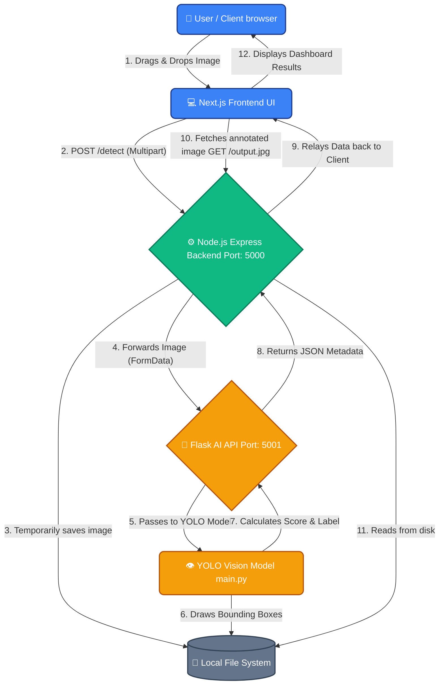

# SentinelAI 🛡️

SentinelAI is an intelligent Human Activity Detection and Surveillance System. It utilizes state-of-the-art YOLO (You Only Look Once) computer vision models to analyze uploaded images, detect human presence, and provide an "Activity Likelihood Score" based on the number of detected individuals.

The system is built using a modern decoupled architecture, combining a highly responsive Next.js frontend, an Express (Node.js) middleware backend, and a robust Python (Flask) computer vision engine.

## 🚀 Architecture Pipeline

SentinelAI is split into three distinct microservices working synchronously:

1. **Frontend (Next.js & Tailwind CSS)**: Provides a beautiful, glassmorphism UI for users to drag-and-drop or upload images.
2. **Backend (Node.js & Express)**: Acts as an API Gateway and storage server. It receives the image from the frontend, relays it to the AI model, and statically serves the output detection image.
3. **Python Model (Flask & YOLO)**: The core AI engine. It receives the image, runs it through the YOLO detection pipeline, draws bounding boxes, and calculates threat/activity metrics.

### 🌊 Flowchart Visualization



## ✨ Key Features
* **Modern UI/UX**: Stunning Glassmorphism interface with drag-and-drop support, animated progress states, and dynamic gradient text.
* **Microservice Architecture**: Fully decoupled system allowing individual components to scale independently.
* **YOLO Computer Vision**: Accurate detection of human subjects using advanced PyTorch models (`yolov8` / `yolo11`).
* **Instant Analytics**: Returns Activity Score (%), Threat Level (HIGH, MEDIUM, LOW), and Region count dynamically.
* **Visual Verification**: Renders the exact input image annotated with AI detection boxes.

## 🛠️ Installation & Setup

You will need three separate terminal windows to run the entire stack.

### 1. The Python AI Engine (Port 5001)
The AI engine requires Python 3 and PyTorch/Ultralytics to be installed.

```bash
cd PythonModel
# Activate your virtual environment (recommended)
.\venv\Scripts\activate
# Install requirements
pip install flask flask-cors ultralytics opencv-python
# Start the API
python pythonApi.py
```
*The Flask server will start running on `http://localhost:5001`.*

### 2. The Node.js Backend (Port 5000)
The Express backend handles image routing and CORS.

```bash
cd backend
# Install dependencies
npm install
# Start the server
node index.js
```
*The Express server will start running on `http://localhost:5000`.*

### 3. The Next.js Frontend (Port 3000)
The user interface.

```bash
cd frontend
# Install dependencies
npm install
# Start the development server
npm run dev
```
*The Next.js app will be accessible at `http://localhost:3000`.*

## 📡 API Reference

### POST `/detect` (Backend API)
- **Endpoint**: `http://localhost:5000/detect`
- **Method**: `POST`
- **Body**: `multipart/form-data` with an `image` key containing the file.
- **Response**:
```json
{
  "score": 85,
  "label": "HIGH",
  "regions": 5,
  "image": "output.jpg"
}
```

### GET `/output.jpg` (Backend API)
- **Endpoint**: `http://localhost:5000/output.jpg`
- **Method**: `GET`
- **Description**: Returns the last analyzed image with YOLO bounding boxes drawn over detected regions.

---
*Built for advanced automated surveillance monitoring.*
